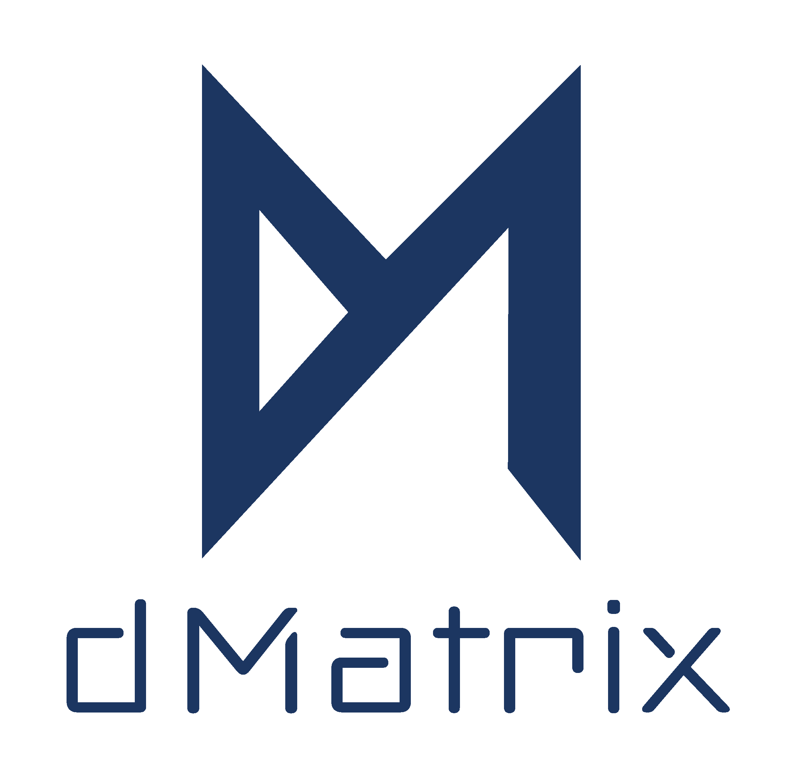
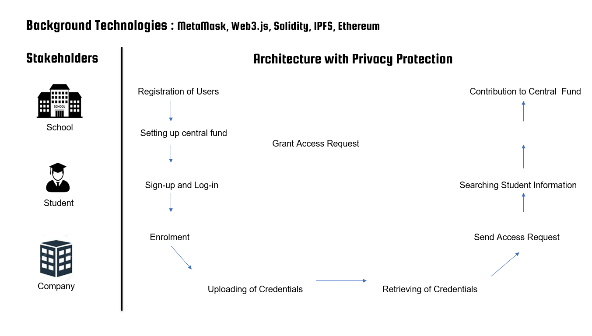

<!--
*** Thanks for checking out the Best-README-Template. If you have a suggestion
*** that would make this better, please fork the repo and create a pull request
*** or simply open an issue with the tag "enhancement".
*** Thanks again! Now go create something AMAZING! :D
***
***
***
*** To avoid retyping too much info. Do a search and replace for the following:
*** github_username, repo_name, twitter_handle, email, project_title, project_description
-->


<!-- PROJECT SHIELDS -->
<!--
*** I'm using markdown "reference style" links for readability.
*** Reference links are enclosed in brackets [ ] instead of parentheses ( ).
*** See the bottom of this document for the declaration of the reference variables
*** for contributors-url, forks-url, etc. This is an optional, concise syntax you may use.
*** https://www.markdownguide.org/basic-syntax/#reference-style-links
-->
[![Contributors][contributors-shield]][contributors-url]
[![Forks][forks-shield]][forks-url]
[![Stargazers][stars-shield]][stars-url]
[![Issues][issues-shield]][issues-url]
[![MIT License][license-shield]][license-url]
[![LinkedIn][linkedin-shield]][linkedin-url]


<!-- PROJECT LOGO -->
<br />
<p align="center">
  <a href="https://github.com/krish-bhanushali/DMatrix">
    
  </a>
    <h2 align="center">DMatrix</h2>
  <h3 align="center">Blockchain Based DApp for Secure Sharing of Student Credentials</h3>
   <h4 align="center">By</h4>
  <h3 align="center">Team Genesis</h3>
   <h3 align="center">PANDIT DEENDAYAL ENERGY UNIVERSITY ,GANDHINAGAR </h3>

  


  <p align="center">
    The exchange of student credentials is an essential and fundamental process of an educational environment that involves multiple stakeholders such as students, schools, instructors, companies, etc. As of today, the procedure is complicated, time-consuming, error-prone and not foolproof. To fix security concerns related to the sharing of student credentials, we incorporate blockchain technology.

Our work suggests a futuristic and pragmatic blockchain architecture for the safe sharing of student credentials and introduces a prototype as a decentralized application (DApp ) based on blockchain .

Experiments on Ethereum will be carried out to test the accuracy of the DApp and evaluate the costs to understand the execution time. The results implies that the existing education system can be enhanced by such a simple, ubiquitous yet secure and user-friendly Blockchain-based DApp and all the stakeholders would reap tremendous benefits.
    <br />
    <a href="https://github.com/krish-bhanushali/DMatrix"><strong>Explore the docs »</strong></a>
    <br />
    <br />
    <a href="https://github.com/krish-bhanushali/DMatrix">View Demo</a>
    ·
    <a href="https://github.com/krish-bhanushali/DMatrix/issues">Report Bug</a>
    ·
    <a href="https://github.com/krish-bhanushali/DMatrix/issues">Request Feature</a>
  </p>
</p>


<!-- TABLE OF CONTENTS -->
<details open="open">
  <summary><h2 style="display: inline-block">Table of Contents</h2></summary>
  <ol>
    <li>
      <a href="#about-the-project">About The Project</a>
      <ul>
        <li><a href="#built-with">Built With</a></li>
      </ul>
    </li>
    <li>
      <a href="#getting-started">Getting Started</a>
      <ul>
        <li><a href="#prerequisites">Prerequisites</a></li>
        <li><a href="#installation">Installation</a></li>
      </ul>
    </li>
    <li><a href="#roadmap">Roadmap</a></li>
    <li><a href="#contributing">Contributing</a></li>
    <li><a href="#license">License</a></li>
    <li><a href="#contact">Contact</a></li>
    
  </ol>
</details>


<!-- ABOUT THE PROJECT -->
## About The Project

  <a href="https://github.com/krish-bhanushali/DMatrix">
    
  </a> 


<h6 align="center">Usecase and Scalability of the Idea</h6>
<p>Our aim is to leverage blockchain technology to mitigate the existing security-related issues concerning the sharing of students’ credentials. Thus, the project proposes a tamper-proof, immutable, authentic, non-repudiable, privacy protected and easy to share blockchain-based architecture for secured sharing of students’ credentials. To increase the scalability, the proposed system uses a secure off-chain storage mechanism(IPFS). The performance and viability of the proposed architecture is analyzed by using an Ethereum based prototypical implementation. 

Its main use case can be explained with an instance; when a student applies for a job, the company carefully checks the authenticity of the received credentials. If required, the company may contact the host institution by phone-call or email to endorse the validity of the credentials. In spite of following such a tedious process, the overall system is insecure, and is facing difficulty to deal with tampered and fake credentials. Hence, numerous advantages can be gained from the use of blockchain in education are immutability and provenance of uploaded credentials, peer-to-peer and secure interactions between stakeholders, transparency and trust within the system, and decentralized control with distributed digital ledger.
</p>

### Built With

* [Metamask]()
* [Web3js]()
* [Solidity]()
* [IPFS]()
* [Ethereum]()


<!-- GETTING STARTED -->
## Getting Started

To get a local copy up and running follow these simple steps.

### Prerequisites

To be Updated Soon


### Installation

1. Clone the repo
   ```sh
   git clone https://github.com/krish-bhanushali/DMatrix.git
   ```
2. To Be Updated Soon


<!-- ROADMAP -->
## Roadmap

See the [open issues](https://github.com/krish-bhanushali/DMatrix/issues) for a list of proposed features (and known issues).


<!-- CONTRIBUTING -->
## Contributing

Contributions are what make the open source community such an amazing place to be learn, inspire, and create. Any contributions you make are **greatly appreciated**.

1. Fork the Project
2. Create your Feature Branch (`git checkout -b feature/AmazingFeature`)
3. Commit your Changes (`git commit -m 'Add some AmazingFeature'`)
4. Push to the Branch (`git push origin feature/AmazingFeature`)
5. Open a Pull Request

If you become a Collaborator Please Refer `Collaborator` for more information 


<!-- LICENSE -->
## License

Distributed under the MIT License. See `LICENSE` for more information.


<!-- CONTACT -->
## Contact

Your Name - [@twitter_handle](https://twitter.com/krishbhanushal8) - bhanushali123krish@gmail.com

Project Link: [https://github.com/krish-bhanushali/DMatrix](https://github.com/krish-bhanushali/DMatrix)


<!-- MARKDOWN LINKS & IMAGES -->
<!-- https://www.markdownguide.org/basic-syntax/#reference-style-links -->
[contributors-shield]: https://img.shields.io/github/contributors/krish-bhanushali/DMatrix.svg?style=for-the-badge
[contributors-url]: https://github.com/krish-bhanushali/DMatrix/graphs/contributors
[forks-shield]: https://img.shields.io/github/forks/krish-bhanushali/DMatrix.svg?style=for-the-badge
[forks-url]: https://github.com/krish-bhanushali/DMatrix/network/members
[stars-shield]: https://img.shields.io/github/stars/krish-bhanushali/DMatrix.svg?style=for-the-badge
[stars-url]: https://github.com/krish-bhanushali/DMatrix/stargazers
[issues-shield]: https://img.shields.io/github/issues/krish-bhanushali/DMatrix.svg?style=for-the-badge
[issues-url]: https://github.com/krish-bhanushali/DMatrix/issues
[license-shield]: https://img.shields.io/github/license/krish-bhanushali/DMatrix.svg?style=for-the-badge
[license-url]: https://github.com/krish-bhanushali/DMatrix/blob/master/LICENSE.txt
[linkedin-shield]: https://img.shields.io/badge/-LinkedIn-black.svg?style=for-the-badge&logo=linkedin&colorB=555
[linkedin-url]: https://linkedin.com/in/krish-bhanushali/